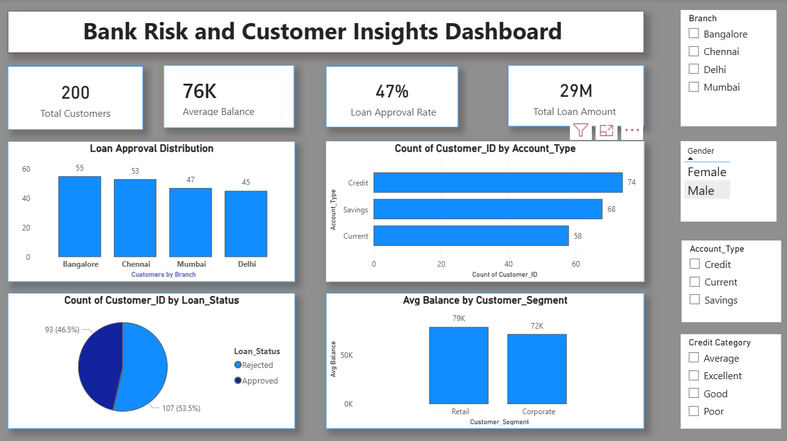
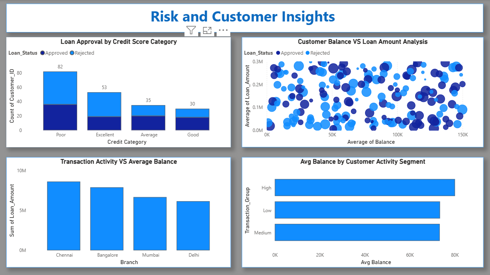

# 🏦 Bank Risk and Customer Insights Dashboard

## 📌 Project Overview

The **Bank Risk and Customer Insights Dashboard** is an interactive Business Intelligence solution developed using **Power BI** to analyze banking operations, customer behavior, financial risk, loan approvals, account performance, and transaction activities.

This project transforms raw banking data into meaningful business insights using:
- Interactive dashboards
- KPI analysis
- DAX calculations
- Customer segmentation
- Financial analytics
- Risk visualization techniques

The entire project was completely **self-developed and unguided**, where all dashboard planning, visualization selection, KPI creation, data transformation, and business insight generation were independently performed.

ChatGPT was used as a learning assistant during development for:
- Understanding Power BI concepts
- Solving technical issues
- Learning DAX functions
- Improving dashboard structure
- Enhancing visualization decisions
- Refining business storytelling

---

# 🎯 Project Goal

The primary objective of this project was to create a professional and interactive banking analytics dashboard capable of:

✅ Monitoring customer financial behavior  
✅ Tracking loan approval performance  
✅ Identifying banking risk patterns  
✅ Understanding customer account distribution  
✅ Comparing branch-level performance  
✅ Analyzing customer transaction activity  
✅ Delivering business insights through visualization  

---

# 💼 Business Problem Statement

Banks generate massive amounts of customer and financial data daily. Without proper analytics systems, it becomes difficult to:

- Identify high-risk customers
- Analyze loan approval efficiency
- Monitor customer financial behavior
- Compare branch performance
- Understand customer segmentation
- Detect financial activity patterns
- Generate business insights from raw data

Manual reporting processes are time-consuming and inefficient.

To solve this challenge, this dashboard centralizes banking analytics into an interactive and visually driven Business Intelligence solution.

---

# 🔍 Complete Project Development Process

## 📍 Requirement Analysis

The first stage involved understanding:
- Banking business metrics
- Loan-related KPIs
- Customer behavior patterns
- Financial reporting requirements
- Dashboard layout planning

The dashboard was designed to ensure:
- Simplicity
- Interactivity
- Business readability
- Professional visualization structure

---

## 📍 Data Collection & Import

The banking dataset was imported into Power BI using CSV/Excel-based data sources.

### Dataset Included:
- Customer IDs
- Branch details
- Loan amounts
- Loan status
- Account types
- Credit score categories
- Customer segments
- Transaction activity groups
- Customer balances

---

## 📍 Data Cleaning & Transformation

Using **Power Query Editor**, multiple data transformation operations were performed.

### Cleaning Tasks Performed:
- Handling missing values
- Renaming columns
- Formatting data types
- Removing inconsistencies
- Preparing structured data for analysis

This improved overall data quality and reporting accuracy.

---

## 📍 Data Modeling

Relationships between data fields were organized to support:
- Efficient filtering
- Cross-visual interaction
- Dynamic reporting
- KPI calculations

### Modeling Concepts Applied:
- Data relationships
- Field organization
- Data hierarchy understanding
- Optimized reporting structure

---

# 🧠 DAX Functions & Calculations Used

Multiple DAX measures and analytical calculations were implemented to create interactive KPIs and business insights.

---

## 📌 DAX Concepts Applied

- CALCULATE()
- COUNT()
- COUNTROWS()
- SUM()
- AVERAGE()
- DIVIDE()
- IF()
- FILTER()
- DISTINCTCOUNT()
- Percentage Calculations
- KPI Measures
- Conditional Logic
- Aggregation Functions

---

## 📊 Key DAX Measures Created

### ✅ Total Customers
```DAX
Total Customers =
COUNT(Customer[Customer_ID])
```

### ✅ Average Balance
```DAX
Average Balance =
AVERAGE(Customer[Balance])
```

### ✅ Total Loan Amount
```DAX
Total Loan Amount =
SUM(Customer[Loan_Amount])
```

### ✅ Approved Loans
```DAX
Approved Loans =
CALCULATE(
    COUNT(Customer[Loan_Status]),
    Customer[Loan_Status] = "Approved"
)
```

### ✅ Rejected Loans
```DAX
Rejected Loans =
CALCULATE(
    COUNT(Customer[Loan_Status]),
    Customer[Loan_Status] = "Rejected"
)
```

### ✅ Loan Approval Rate
```DAX
Loan Approval Rate =
DIVIDE(
    [Approved Loans],
    [Total Customers],
    0
)
```

---

## 📈 Advanced Analytical Logic

The dashboard also involved:
- Dynamic percentage calculations
- Cross-filter interactions
- Customer segmentation analysis
- Branch-wise performance tracking
- Financial activity analysis
- Credit score category comparisons
- Risk visualization logic

These DAX calculations helped transform raw banking data into meaningful and interactive business insights.

---

# 📊 Dashboard Architecture

The dashboard contains **2 fully interactive report pages**.

---

# 🔹 Dashboard Page 1 — Customer & Loan Overview

This page focuses on customer distribution, loan analysis, and overall banking performance.

---

## 📌 KPIs Included

### ✅ Total Customers
Displays total customer count.

### ✅ Average Balance
Shows average customer balance.

### ✅ Loan Approval Rate
Represents percentage of approved loans.

### ✅ Total Loan Amount
Displays total amount of loans issued.

---

## 📌 Visual Insights Included

### 📊 Loan Approval Distribution
Branch-wise analysis of customer loans.

### 📊 Account Type Analysis
Customer distribution across:
- Credit Accounts
- Savings Accounts
- Current Accounts

### 📊 Loan Status Analysis
Comparison between approved and rejected loans.

### 📊 Customer Segment Analysis
Average balance comparison between:
- Retail Customers
- Corporate Customers

---

# 🔹 Dashboard Page 2 — Risk & Customer Insights

This page focuses on customer financial behavior and banking risk analysis.

---

## 📌 Visual Insights Included

### 📊 Loan Approval by Credit Score Category
Analysis of loan approvals across:
- Excellent
- Good
- Average
- Poor credit categories

### 📊 Customer Balance vs Loan Amount Analysis
Scatter plot showing relationship between:
- Customer balance
- Loan amount
- Loan approval status

### 📊 Transaction Activity vs Average Balance
Branch-level financial activity analysis.

### 📊 Customer Activity Segmentation
Analysis of:
- High Activity Customers
- Medium Activity Customers
- Low Activity Customers

---

# 🎨 Dashboard Design Features

The dashboard was designed using:
- Consistent white-blue theme
- Interactive slicers
- Professional card-based layout
- Business-focused visualization hierarchy
- Clean dashboard spacing
- User-friendly interface design

---

# ⚙️ Interactive Features

The dashboard includes:

✅ Interactive slicers  
✅ Dynamic filtering  
✅ Branch-wise analysis  
✅ Gender-based filtering  
✅ Account type filtering  
✅ Credit score filtering  
✅ Cross-visual interactions  
✅ Dynamic KPI calculations  

These features improve user interaction and business exploration.

---

# 🛠️ Tech Stack Used

## 📊 Business Intelligence
- Power BI Desktop

## 📈 Data Analysis
- DAX (Data Analysis Expressions)

## 🧹 Data Cleaning & Transformation
- Power Query Editor

## 📂 Data Source
- CSV Dataset
- Excel-Based Data

## 📉 Data Visualization
- KPI Cards
- Bar Charts
- Pie Charts
- Scatter Plots
- Clustered Bar Charts
- Interactive Filters & Slicers

## 💻 Version Control & Portfolio
- GitHub

---

# 📂 Repository Structure

```bash
Bank-Risk-and-Customer-Insights-Dashboard/
│
├── Bank_Risk_and_Customer_Insights_Dashboard.pbix
├── bank_dashboard_dataset.csv
├── dashboard-overview-page1.png
├── risk-analysis-page2.png
└── README.md
```

---

# 📷 Dashboard Screenshots

## 📌 Customer & Loan Overview Dashboard


---

## 📌 Risk & Customer Insights Dashboard


---

# 📈 Key Business Insights Generated

✅ Loan approval performance varies across branches  
✅ Customer activity levels influence average balances  
✅ Credit score categories affect loan approval rates  
✅ Branch-wise financial behavior reveals operational trends  
✅ Account type distributions highlight customer preferences  
✅ Risk segmentation improves banking analysis  

---

# 🚀 Skills Demonstrated

This project demonstrates practical understanding of:

- Business Intelligence
- Power BI Dashboard Development
- DAX Calculations
- Data Cleaning
- Data Modeling
- Data Visualization
- Dashboard UI/UX Design
- Analytical Thinking
- Financial Analytics
- Business Insight Generation
- Interactive Reporting
- Problem Solving
- Data Storytelling

---

# 📚 Learning Outcomes

Through this project, I improved my understanding of:

- Real-world dashboard development
- Business-focused analytics
- KPI creation using DAX
- Interactive reporting systems
- Professional dashboard structuring
- Business problem-solving through analytics
- Financial data visualization
- Insight-driven storytelling

---

# 🔮 Future Enhancements

Planned future improvements include:

- Advanced DAX calculations
- Forecasting visuals
- Real-time banking data integration
- Drill-through analytics
- Mobile dashboard optimization
- Power BI Service deployment
- AI-driven analytics integration

---

# 🤝 Acknowledgment

This project was independently developed for learning, portfolio building, and practical skill development.

ChatGPT was used as a learning assistant for:
- Concept clarification
- DAX understanding
- Dashboard improvement ideas
- Visualization refinement
- Troubleshooting
- Business insight discussions

---

# ⭐ Final Conclusion

The **Bank Risk and Customer Insights Dashboard** reflects my ability to independently build interactive Business Intelligence solutions using Power BI.

This project demonstrates:
- Analytical thinking
- Dashboard development capability
- Data storytelling
- Business problem-solving
- Financial analytics understanding
- Self-learning ability
- Practical Power BI skills

It represents my growing expertise in:
- Data Analytics
- Business Intelligence
- Power BI Development
- Financial Data Visualization
- Insight-Driven Reporting

---
